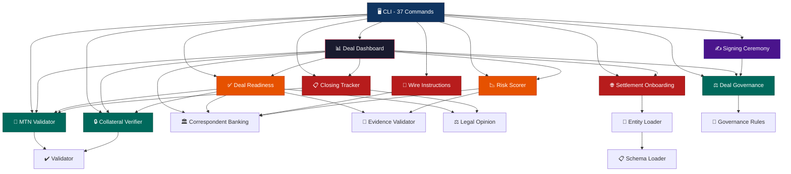
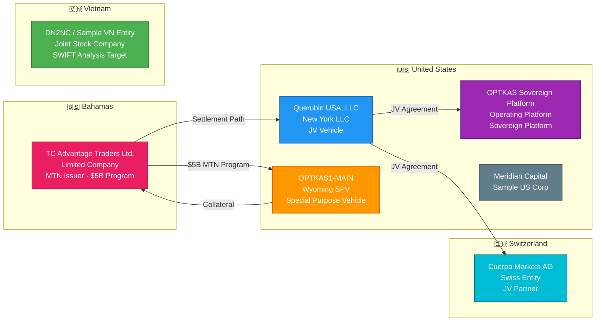
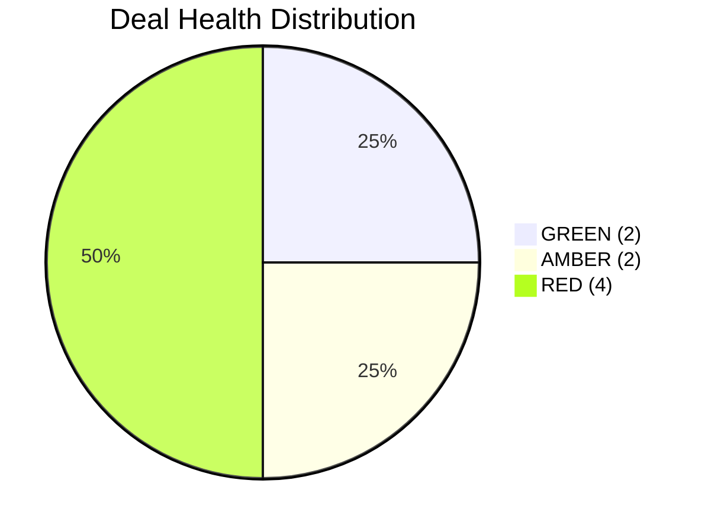
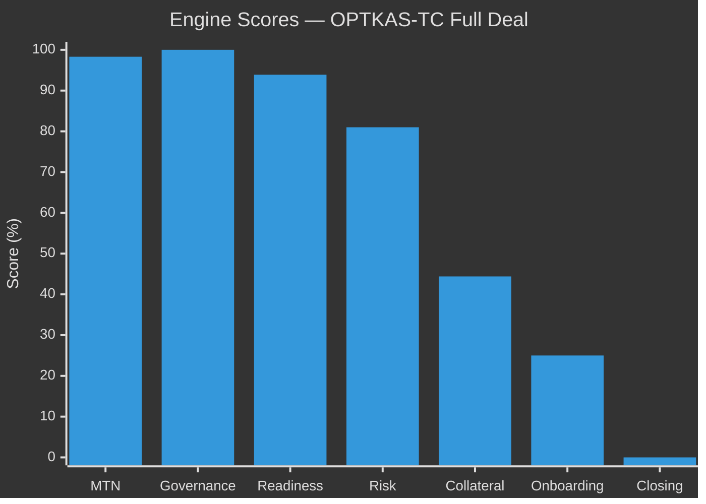
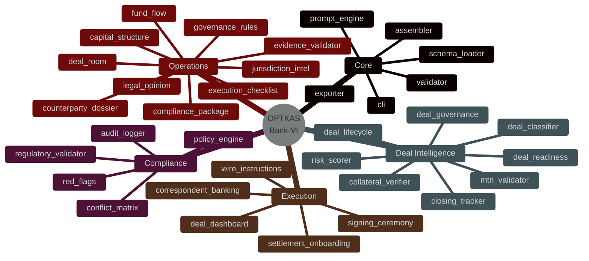
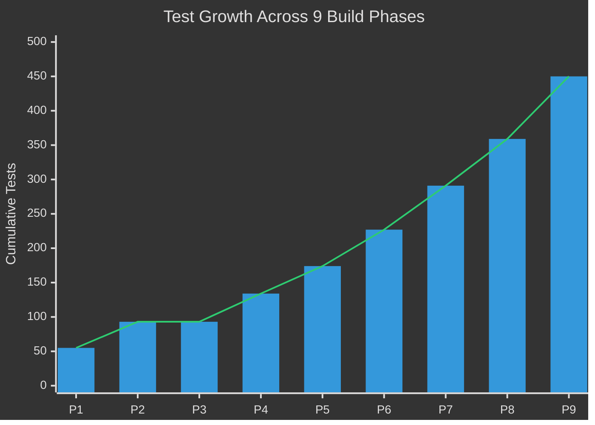
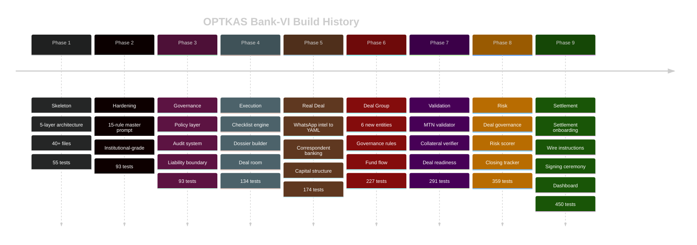
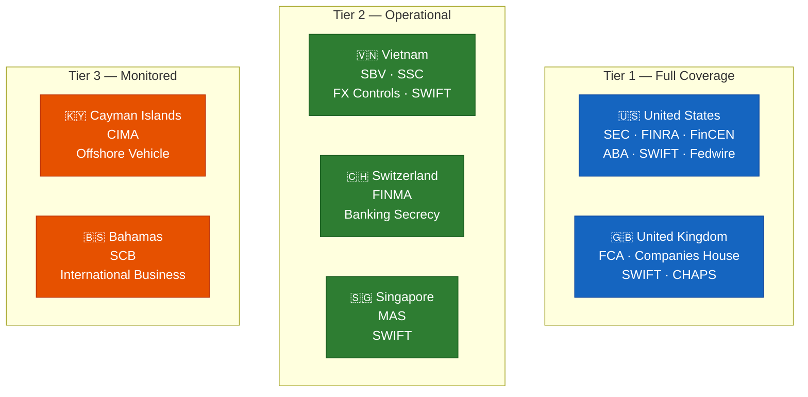
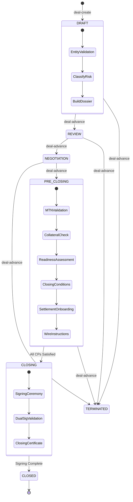
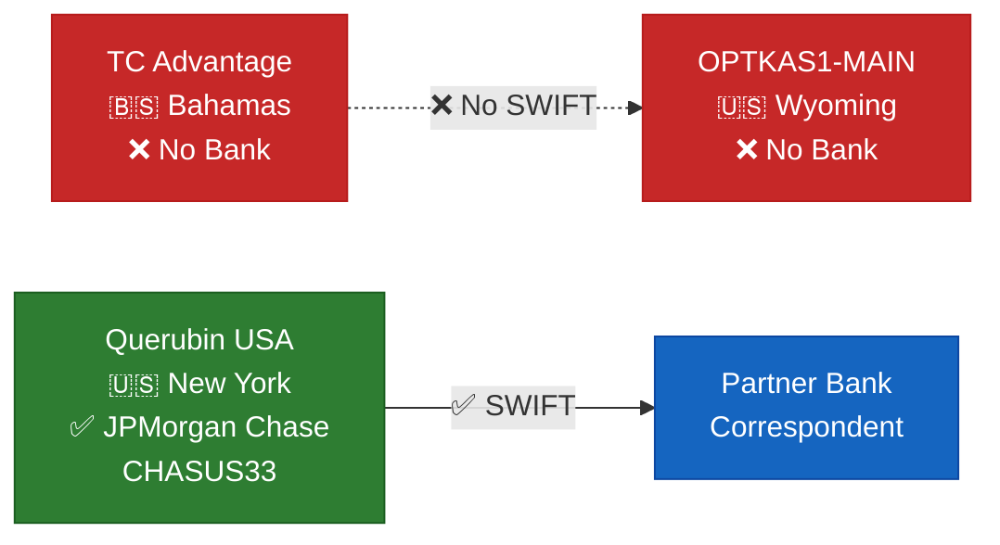

<p align="center">
  
</p>

<h1 align="center">OPTKAS Bank-VI</h1>
<h3 align="center">Sovereign-Grade Capital Markets Compliance & Deal Execution Platform</h3>

<p align="center">
  
  
  
  
  
  
</p>

<p align="center">
  
  
  
  
  
  
</p>

---

## 📋 Table of Contents

| # | Section | Description |
|---|---------|-------------|
| 1 | [🏗️ System Architecture](#-system-architecture) | 5-layer engine design with dependency graph |
| 2 | [⚡ Quick Start](#-quick-start) | Installation and first run |
| 3 | [🔧 CLI Command Reference](#-cli-command-reference) | All 37 commands grouped by function |
| 4 | [🏢 Entity Ecosystem](#-entity-ecosystem) | 7 entity profiles and evidence map |
| 5 | [📊 Deal Dashboard (Live RAG)](#-deal-dashboard-live-rag) | Real-time Red/Amber/Green status |
| 6 | [🔍 Engine Module Catalog](#-engine-module-catalog) | 34 engine modules with capabilities |
| 7 | [🧪 Test Coverage](#-test-coverage) | 450 tests across 9 phases |
| 8 | [📈 Build Progression](#-build-progression) | Phase-by-phase growth chart |
| 9 | [🌐 Jurisdiction Intelligence](#-jurisdiction-intelligence) | Multi-jurisdiction regulatory map |
| 10 | [💰 Deal Flow Pipeline](#-deal-flow-pipeline) | End-to-end deal lifecycle |
| 11 | [🏦 Settlement Infrastructure](#-settlement-infrastructure) | Banking rails and wire routing |
| 12 | [📁 Project Structure](#-project-structure) | File tree and organization |

---

## 🏗️ System Architecture

```
┌─────────────────────────────────────────────────────────────────────┐
│                        OPTKAS BANK-VI                              │
│              Sovereign Capital Markets Platform                     │
├─────────────────────────────────────────────────────────────────────┤
│                                                                     │
│   ┌─────────────┐  ┌──────────────┐  ┌──────────────┐              │
│   │  37 CLI     │  │  34 Engine   │  │  450 Tests   │              │
│   │  Commands   │  │  Modules     │  │  (9 Phases)  │              │
│   └──────┬──────┘  └──────┬───────┘  └──────┬───────┘              │
│          │                │                  │                      │
│   ┌──────▼──────────────────────────────────────────────────┐      │
│   │                   ENGINE CORE                            │      │
│   │  ┌──────────┐ ┌──────────┐ ┌──────────┐ ┌──────────┐   │      │
│   │  │ Validator│ │ Assembler│ │ Exporter │ │ Prompter │   │      │
│   │  └──────────┘ └──────────┘ └──────────┘ └──────────┘   │      │
│   └─────────────────────────────────────────────────────────┘      │
│                              │                                      │
│   ┌──────────────────────────▼──────────────────────────────┐      │
│   │                  COMPLIANCE LAYER                        │      │
│   │  ┌──────────┐ ┌──────────┐ ┌──────────┐ ┌──────────┐   │      │
│   │  │Regulatory│ │ Conflict │ │Red Flags │ │  Policy  │   │      │
│   │  │ Matrix   │ │ Matrix   │ │ Scanner  │ │ Engine   │   │      │
│   │  └──────────┘ └──────────┘ └──────────┘ └──────────┘   │      │
│   └─────────────────────────────────────────────────────────┘      │
│                              │                                      │
│   ┌──────────────────────────▼──────────────────────────────┐      │
│   │                 DEAL EXECUTION LAYER                     │      │
│   │  ┌──────────┐ ┌──────────┐ ┌──────────┐ ┌──────────┐   │      │
│   │  │  MTN     │ │Collateral│ │ Deal     │ │ Closing  │   │      │
│   │  │Validator │ │ Verifier │ │Readiness │ │ Tracker  │   │      │
│   │  └──────────┘ └──────────┘ └──────────┘ └──────────┘   │      │
│   └─────────────────────────────────────────────────────────┘      │
│                              │                                      │
│   ┌──────────────────────────▼──────────────────────────────┐      │
│   │              SETTLEMENT & SIGNING LAYER                  │      │
│   │  ┌──────────┐ ┌──────────┐ ┌──────────┐ ┌──────────┐   │      │
│   │  │Settlement│ │  Wire    │ │ Signing  │ │  Deal    │   │      │
│   │  │Onboarding│ │Instruct. │ │ Ceremony │ │Dashboard │   │      │
│   │  └──────────┘ └──────────┘ └──────────┘ └──────────┘   │      │
│   └─────────────────────────────────────────────────────────┘      │
│                              │                                      │
│   ┌──────────────────────────▼──────────────────────────────┐      │
│   │                   DATA LAYER                             │      │
│   │  ┌──────────┐ ┌──────────┐ ┌──────────┐ ┌──────────┐   │      │
│   │  │ Entity   │ │ Evidence │ │Jurisdict.│ │ Contract │   │      │
│   │  │ YAMLs    │ │ Vault    │ │  Rules   │ │ Modules  │   │      │
│   │  └──────────┘ └──────────┘ └──────────┘ └──────────┘   │      │
│   └─────────────────────────────────────────────────────────┘      │
│                                                                     │
└─────────────────────────────────────────────────────────────────────┘
```

### Engine Dependency Graph



---

## ⚡ Quick Start

```bash
# Clone
git clone https://github.com/unykornai/optkas-bank-vi.git
cd optkas-bank-vi

# Install
pip install -r requirements.txt

# Verify — 450 tests
python -m pytest tests/ -v

# Run the Unified Dashboard
python -m engine.cli deal-dashboard \
  -n "OPTKAS-TC Full Deal" \
  -i data/entities/tc_advantage_traders.yaml \
  -s data/entities/optkas1_spv.yaml \
  -e data/entities/optkas_platform.yaml \
  -e data/entities/querubin_usa.yaml
```

**Requirements:** Python 3.11+ &nbsp;|&nbsp; PyYAML &nbsp;|&nbsp; Jinja2 &nbsp;|&nbsp; Rich &nbsp;|&nbsp; Click &nbsp;|&nbsp; python-docx

---

## 🔧 CLI Command Reference

### 37 Commands — Grouped by Function

#### 🟦 Core Document Generation
| Command | Description | Key Flags |
|---------|-------------|-----------|
| `generate` | Assemble complete agreement from entity data | `-e, -t, --modules` |
| `prompt` | Build structured LLM prompt package | `-e, -t` |
| `legal-opinion` | Generate institutional-grade legal opinion | `-e, -t, --save` |
| `export` | Convert Markdown to DOCX or PDF | `-i, -f` |

#### 🟩 Validation & Compliance
| Command | Description | Key Flags |
|---------|-------------|-----------|
| `validate` | Validate entity against schema & jurisdiction rules | `-e` |
| `regulatory-check` | Validate regulatory claims against matrix | `-e` |
| `compliance-report` | Full compliance check with scoring | `-e, -e2` |
| `compliance-pkg` | Generate full compliance package for a deal | `-n, -e [multiple]` |
| `conflict-matrix` | Analyze governing law & jurisdiction conflicts | `-e, -e2` |
| `evidence` | Validate evidence files for an entity | `-e` |
| `policy` | Display organizational execution policy | — |

#### 🟨 Entity & Transaction Management
| Command | Description | Key Flags |
|---------|-------------|-----------|
| `deal-entities` | List all entity profiles | — |
| `list-modules` | List available contract modules | — |
| `list-types` | List transaction types | — |
| `list-jurisdictions` | List supported jurisdictions | — |
| `deal-classify` | Auto-classify deal risk tier | `-e, -e2, -t` |

#### 🟧 Deal Lifecycle
| Command | Description | Key Flags |
|---------|-------------|-----------|
| `deal-create` | Create new deal in DRAFT state | `-n, -e [multiple]` |
| `deal-advance` | Advance deal to next lifecycle state | `-n` |
| `deal-status` | Show deal lifecycle status | `-n` |
| `deal-room` | Package complete deal room | `-n, -i, -s, --save` |

#### 🟪 Deal Intelligence
| Command | Description | Key Flags |
|---------|-------------|-----------|
| `mtn-validate` | Validate MTN program structure | `-i, -s, -e [multiple]` |
| `collateral-check` | Verify collateral/SPV integrity | `-i, -s` |
| `deal-ready` | Full deal readiness assessment | `-n, -i, -s, -e` |
| `deal-governance` | Assess deal governance framework | `-n, -e [multiple]` |
| `risk-score` | Multi-factor counterparty risk score | `-n, -e [multiple]` |
| `closing-tracker` | Generate conditions precedent tracker | `-n, -i, -s, -e` |

#### 🟥 Execution Infrastructure
| Command | Description | Key Flags |
|---------|-------------|-----------|
| `settlement-path` | Map cross-border settlement path | `-e, -e2` |
| `settlement-onboard` | Detect banking gaps, generate onboarding | `-n, -e [multiple]` |
| `wire-instructions` | Generate institutional wire packages | `-n, -o, -b, -a, -c` |
| `signing-ceremony` | Prepare deal signing with authority validation | `-n, -e [multiple]` |
| `deal-dashboard` | **Unified RAG dashboard (all engines)** | `-n, -i, -s, -e` |

#### ⬛ Operational Tools
| Command | Description | Key Flags |
|---------|-------------|-----------|
| `dossier` | Build counterparty risk dossier | `-e` |
| `checklist` | Generate pre-closing execution checklist | `-e, -e2, -t` |
| `cap-structure` | Build capital allocation structure | `-n, config` |
| `fund-flow` | Display fund flow status | `config` |
| `governance` | Build governance framework | `-n, -e [multiple]` |
| `jurisdiction` | Query jurisdiction intelligence database | subcommands |

---

## 🏢 Entity Ecosystem



### Entity Banking Status

| Entity | Jurisdiction | Type | Settlement Bank | SWIFT | Status |
|--------|-------------|------|----------------|-------|--------|
| 🟢 Querubin USA | US-NY | LLC | JPMorgan Chase | CHASUS33 | **COMPLETE** |
| 🔴 TC Advantage | BS | Ltd. Company | ❌ None | ❌ None | **NEEDS ONBOARDING** |
| 🔴 OPTKAS1-MAIN | US-WY | SPV | ❌ None | ❌ None | **NEEDS ONBOARDING** |
| 🔴 OPTKAS Platform | US | Sovereign | ❌ None | ❌ None | **NEEDS ONBOARDING** |

### Evidence Vault — 13 Documents

| Entity | Document | Type |
|--------|----------|------|
| TC Advantage | PPM_TC_Advantage_5B_MTN.pdf | Private Placement Memo |
| TC Advantage | CJColeman_Lloyds_Insurance_625M.pdf | Insurance Certificate |
| TC Advantage | STC_Position_Report_Jan2026.pdf | Position Report |
| TC Advantage | TC_Scan_Document.pdf | Scanned Document |
| Querubin USA | CIS_Querubin_USA_Feb2025.pdf | Corporate Info Sheet |
| Querubin USA | JV_Summary_OPTKAS.docx | JV Summary |
| Querubin USA | JV_Summary_Cuerpo_Markets.pdf | JV Summary |
| Querubin USA | Risk_Compliance_Package.docx | Compliance Package |
| OPTKAS1 SPV | Opinion_KKnowles_Bahamas_Jan2026.pdf | Legal Opinion (Final) |
| OPTKAS1 SPV | Opinion_US_Counsel_DRAFT_Jan2026.docx | Legal Opinion (Draft) |
| DN2NC | DN2NC_SWIFT_Analysis.docx | SWIFT Analysis |

---

## 📊 Deal Dashboard (Live RAG)

> Real-time unified status from the `deal-dashboard` command, aggregating all 8 engines:

```
╔══════════════════════════════════════════════════════════════╗
║                    DEAL DASHBOARD                           ║
║                 OPTKAS-TC Full Deal                          ║
║                                                              ║
║  OVERALL STATUS:  🔴 RED                                    ║
║  Green: 2  |  Amber: 2  |  Red: 4  |  Grey: 0              ║
╠══════════════════════════════════════════════════════════════╣
║                                                              ║
║  🟢 MTN Program ................ 98.3%   VALIDATED          ║
║  🔴 Collateral ................. 44.4%   CRITICAL ISSUES    ║
║  🟡 Deal Readiness ............. 93.9%   CONDITIONAL        ║
║  🟢 Governance ................. 100%    GRADE A            ║
║  🟡 Risk Score ................. 81.0%   GRADE B / MODERATE ║
║  🔴 Closing Conditions ......... 0%      0/8 CPs MET       ║
║  🔴 Settlement ................. ——      INVALID PATH       ║
║  🔴 Banking Onboarding ......... 25%     3/4 NEED ONBOARD  ║
║                                                              ║
╠══════════════════════════════════════════════════════════════╣
║  EXECUTIVE ACTION ITEMS: 17                                  ║
╚══════════════════════════════════════════════════════════════╝
```

### Dashboard Section Breakdown



### Scoring Across All Engines



---

## 🔍 Engine Module Catalog

### 34 Modules — 13,806 Lines of Engine Code



| Layer | Module | Purpose |
|-------|--------|---------|
| **Core** | `cli.py` | 37-command Click CLI |
| **Core** | `validator.py` | Entity schema + jurisdiction validation |
| **Core** | `assembler.py` | Contract document assembly |
| **Core** | `prompt_engine.py` | LLM prompt package builder |
| **Core** | `schema_loader.py` | YAML schema loading |
| **Core** | `exporter.py` | DOCX/PDF export |
| **Compliance** | `regulatory_validator.py` | Regulatory matrix validation |
| **Compliance** | `conflict_matrix.py` | Jurisdiction conflict analysis |
| **Compliance** | `red_flags.py` | Pattern-based risk scanning |
| **Compliance** | `policy_engine.py` | Organizational policy enforcement |
| **Compliance** | `audit_logger.py` | Immutable audit trail |
| **Deal Intel** | `mtn_validator.py` | MTN program validation (29 checks) |
| **Deal Intel** | `collateral_verifier.py` | Collateral/SPV integrity |
| **Deal Intel** | `deal_readiness.py` | Multi-dimensional readiness |
| **Deal Intel** | `deal_governance.py` | Governance framework assessment |
| **Deal Intel** | `risk_scorer.py` | 5-factor counterparty risk |
| **Deal Intel** | `closing_tracker.py` | Conditions precedent tracking |
| **Deal Intel** | `deal_classifier.py` | Risk tier classification |
| **Deal Intel** | `deal_lifecycle.py` | State machine management |
| **Execution** | `deal_dashboard.py` | Unified RAG dashboard (8 engines) |
| **Execution** | `settlement_onboarding.py` | Banking gap detection + onboarding |
| **Execution** | `wire_instructions.py` | Wire instruction generation + OFAC |
| **Execution** | `signing_ceremony.py` | Authority validation + dual-sig |
| **Execution** | `correspondent_banking.py` | Settlement path mapping |
| **Operations** | `legal_opinion.py` | Institutional legal opinion generator |
| **Operations** | `counterparty_dossier.py` | Risk dossier builder |
| **Operations** | `execution_checklist.py` | Pre-closing checklist |
| **Operations** | `deal_room.py` | Deal room packager |
| **Operations** | `capital_structure.py` | Capital allocation engine |
| **Operations** | `fund_flow.py` | Fund flow tracking |
| **Operations** | `governance_rules.py` | Governance framework builder |
| **Operations** | `compliance_package.py` | Full compliance package |
| **Operations** | `evidence_validator.py` | Evidence file validation |
| **Operations** | `jurisdiction_intel.py` | Jurisdiction intelligence DB |

---

## 🧪 Test Coverage

### 450 Tests — 10 Test Files — 3,365 Lines of Test Code



| Test File | Tests | Coverage Area |
|-----------|-------|---------------|
| `test_validator.py` | 10 | Entity loading, schema validation, cross-border |
| `test_assembler.py` | 14 | Contract assembly, module composition |
| `test_hardened.py` | 24 | Edge cases, encoding, error handling |
| `test_institutional.py` | 17 | Policy, audit, liability, classification |
| `test_prompt_engine.py` | 8 | LLM prompt generation |
| `test_execution.py` | 21 | Checklist, dossier, deal room, lifecycle |
| `test_real_deal.py` | 40 | Real entities, correspondent banking, capital |
| `test_phase6.py` | 53 | Deal group, governance rules, fund flow |
| `test_phase7.py` | 64 | MTN validator, collateral, deal readiness |
| `test_phase8.py` | 68 | Governance, risk scoring, closing tracker |
| `test_phase9.py` | 91 | Settlement, wire, signing, dashboard |

```
✅ 450 passed in 14.37s
```

---

## 📈 Build Progression

### 9 Phases — From Skeleton to Sovereign Platform



| Phase | Theme | New Modules | New Tests | Cumulative |
|-------|-------|-------------|-----------|------------|
| **1** | Foundation | 12 | 55 | 55 |
| **2** | Hardening | 3 | 38 | 93 |
| **3** | Institutional Governance | 4 | — | 93 |
| **4** | Execution Layer | 4 | 41 | 134 |
| **5** | Real Deal Infrastructure | 3 | 40 | 174 |
| **6** | Expanded Deal Group | 3 | 53 | 227 |
| **7** | Deal Validation | 3 | 64 | 291 |
| **8** | Governance & Risk | 3 | 68 | 359 |
| **9** | Settlement & Signing | 4 | 91 | **450** |

---

## 🌐 Jurisdiction Intelligence

### Supported Jurisdictions



### Cross-Border Detection

| Feature | Implementation |
|---------|----------------|
| 🔄 **FX Controls** | Vietnam dong (VND) requires SBV approval |
| 📋 **Regulatory Matrix** | Auto-maps required licenses per jurisdiction |
| ⚖️ **Conflict Analysis** | Identifies governing law conflicts |
| 🚫 **Sanctions Screening** | OFAC/SDN/AML — Iran, North Korea, Cuba, Syria, Russia blocked |

---

## 💰 Deal Flow Pipeline



### Current Deal: `OPTKAS-TC Full Deal`

| Gate | Status | Detail |
|------|--------|--------|
| Entity Validation | 🟢 | All 4 entities loaded |
| MTN Program | 🟢 98.3% | 28 PASS, 1 WARN |
| Governance | 🟢 Grade A | 5 signatories in authority map |
| Deal Readiness | 🟡 CONDITIONAL | Draft opinions pending |
| Risk Assessment | 🟡 Grade B (81) | Unscreened beneficial owners |
| Collateral | 🔴 44.4% | No UCC filing |
| Closing CPs | 🔴 0/8 | All conditions open |
| Settlement | 🔴 INVALID | No banking intermediary |
| Banking | 🔴 3/4 unbanked | TC Advantage, OPTKAS1, OPTKAS Platform |
| Signing | ⬜ Not Started | Blocked by above |

---

## 🏦 Settlement Infrastructure

### Settlement Path Analysis



### Recommended Banks (Auto-Generated)

| Entity | Jurisdiction | Recommended Bank | SWIFT | Tier | Fit |
|--------|-------------|-----------------|-------|------|-----|
| TC Advantage | 🇧🇸 BS | Scotiabank (Bahamas) | NOSCBSNS | International | 70 |
| OPTKAS1-MAIN | 🇺🇸 US-WY | JPMorgan Chase | CHASUS33 | GSIB | 80 |
| OPTKAS Platform | 🇺🇸 US | JPMorgan Chase | CHASUS33 | GSIB | 75 |

### Wire Instruction Compliance

```
WIRE-20260212201008-001  |  TC Advantage → OPTKAS1-MAIN
Amount: USD 10,000,000.00  |  Purpose: MTN subscription payment
Status: DRAFT  |  FX Required: YES

⚠️  7 Compliance Warnings:
  [!] Originator has no settlement bank
  [!] Beneficiary has no settlement bank
  [!] Originator has no SWIFT/BIC or ABA
  [!] Beneficiary has no SWIFT/BIC or ABA
  [!] Settlement path < 3 nodes (no banking intermediary)
  [!] No SWIFT-capable node in chain
  [!] Direct entity-to-entity path detected
```

---

## 📁 Project Structure

```
optkas-bank-vi/
├── 📄 pyproject.toml              # Project metadata & dependencies
├── 📄 requirements.txt            # Pip requirements
├── 📄 README.md                   # This file
│
├── 🔧 engine/                     # 34 modules · 13,806 LOC
│   ├── cli.py                     # 37-command CLI
│   ├── validator.py               # Entity validation
│   ├── assembler.py               # Document assembly
│   ├── prompt_engine.py           # LLM prompt builder
│   ├── schema_loader.py           # Schema loading
│   ├── exporter.py                # DOCX/PDF export
│   ├── regulatory_validator.py    # Regulatory matrix
│   ├── conflict_matrix.py         # Jurisdiction conflicts
│   ├── red_flags.py               # Risk scanner
│   ├── policy_engine.py           # Policy enforcement
│   ├── audit_logger.py            # Audit trail
│   ├── deal_classifier.py         # Risk classification
│   ├── deal_lifecycle.py          # State machine
│   ├── counterparty_dossier.py    # Risk dossier
│   ├── execution_checklist.py     # Pre-closing checklist
│   ├── deal_room.py               # Deal room packager
│   ├── legal_opinion.py           # Legal opinion generator
│   ├── evidence_validator.py      # Evidence validation
│   ├── correspondent_banking.py   # Settlement path mapping
│   ├── capital_structure.py       # Capital allocation
│   ├── jurisdiction_intel.py      # Jurisdiction database
│   ├── governance_rules.py        # Governance framework
│   ├── fund_flow.py               # Fund tracking
│   ├── compliance_package.py      # Compliance packaging
│   ├── mtn_validator.py           # MTN validator (29 checks)
│   ├── collateral_verifier.py     # Collateral verification
│   ├── deal_readiness.py          # Readiness assessment
│   ├── deal_governance.py         # Governance assessment
│   ├── risk_scorer.py             # 5-factor risk scoring
│   ├── closing_tracker.py         # CP tracking
│   ├── settlement_onboarding.py   # Banking gap detection
│   ├── wire_instructions.py       # Wire generation + OFAC
│   ├── signing_ceremony.py        # Signing + dual-sig
│   └── deal_dashboard.py          # Unified RAG dashboard
│
├── 📊 data/
│   ├── entities/                   # 7 entity YAML profiles
│   ├── evidence/                   # 13 evidence documents
│   ├── transactions/               # Transaction type definitions
│   └── jurisdiction_intel/         # Learned jurisdiction data
│
├── 📜 contracts/modules/           # 18 contract clause modules
├── ⚖️ rules/jurisdictions/         # 7 jurisdiction rule files
├── 📝 prompts/master_prompt.md     # 15-rule institutional prompt
│
├── 🧪 tests/                      # 450 tests · 3,365 LOC
│   ├── test_validator.py          # 10 tests
│   ├── test_assembler.py          # 14 tests
│   ├── test_hardened.py           # 24 tests
│   ├── test_institutional.py      # 17 tests
│   ├── test_prompt_engine.py      # 8 tests
│   ├── test_execution.py          # 21 tests
│   ├── test_real_deal.py          # 40 tests
│   ├── test_phase6.py             # 53 tests
│   ├── test_phase7.py             # 64 tests
│   ├── test_phase8.py             # 68 tests
│   └── test_phase9.py             # 91 tests
│
└── 📋 output/                      # Generated outputs (gitignored)
```

---

## 🔒 Security & Compliance

| Feature | Implementation |
|---------|---------------|
| **Sanctions Screening** | OFAC/SDN check on all wire instructions. IR, KP, CU, SY, RU auto-blocked |
| **KYC/AML** | Beneficial owner tracking, sanctions screening flags |
| **Dual Signature** | Enforced on binding documents (subscription, NPA, security agreements) |
| **Audit Trail** | Immutable JSON audit log with timestamps |
| **Liability Boundary** | Institutional-grade banner on all generated documents |
| **Policy Enforcement** | 15-rule organizational execution policy |
| **Evidence Chain** | SHA-linked evidence validation per entity |

---

<p align="center">
  <br/>
  
  <br/><br/>
  <em>Sovereign-grade. Real entities. Real compliance. Real execution.</em>
  <br/>
  <sub>450 tests · 37 CLI commands · 34 engine modules · 17,171 lines of code</sub>
</p>
